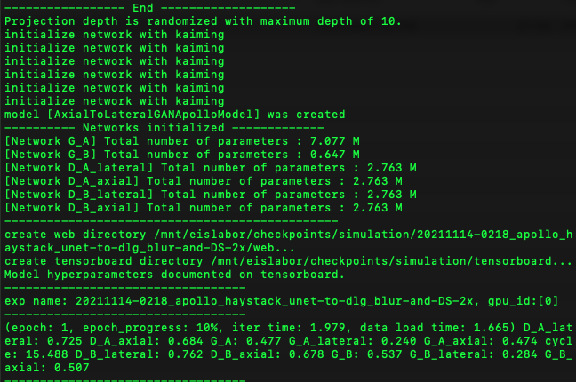
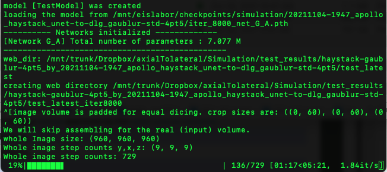

# README

### **Github link**: [https://github.com/peterpark-git/neuroclear](https://github.com/peterpark-git/neuroclear)
### **Data repository:  click [here](https://www.dropbox.com/sh/a83wfw31blf04x9/AACHBx16P9YPEHS7DDQUWBh6a?dl=0).**

# Neuroclear

Neuroclear is a deep-learning-based Python module to train a deep neural network for the task of applying super-resolution to degraded axial resolution in Fluorescence microscopy, using a single image stack. For demo, we provide a Jupyter notebook where you can generate your own randomized synthetic image volume. You can use our github code to train a deep learning model and test with a ground-truth. 


Example of large-scale resolution enhancement for axial resolution in confocal fluorescence microscopy

# System requirements

## General requirements

### Software

- Python 3.8 (tested on)
- Conda
- Pytorch 1.8. (tested on)
- CUDA version 11.4 (tested on)
- Linux (tested on Ubuntu 20.04)
- Jupyter notebook

### Hardware

- CPU or  GPU that supports CUDA CuDNN and  Pytorch 1.9.
- We tested on RTX 3090 and GTX 1080-Ti.
- We recommend RAM memory of more than 16 Gb (for 3D volume inference).

# Installation guide

## Instructions

- Install Pytorch and other dependencies. The main Python dependencies include:

```bash
numpy
scipy
scikit-learn
pytorch 
tensorboard
dominate
```

For a complete list of dependencies, please refer to the file in **conda_environment folder**. 

- Install CUDA
**Make sure the CUDA environment is set up (tested on CUDA 11.1).**

- Clone this repo:

```bash
git clone https://github.com/peterpark-git/neuroclear
cd neuroclear
```

- Set up a virtual conda environment.

1. Go to the conda_environment folder. 
2. Download the necessary packages and create a virtual environment using the following command. 
```bash
conda env create -f neuroclear_environment.yml
```
3. When all packages are installed, activate the environment and you should be able to run the codes without an issue. 

```bash
conda activate neuroclear
```

- While the typical install time will vary widely depending on the environment, the whole process of installing every software modules and dependencies will take 1-2 hours. 
- Docker environment will be available soon.

# Demo

### Generating a synthetic image volume

- To generate a 3D synthetic volume, go to **jupyter_notebook** folder, and run the script **Data Generator for Simulation.ipynb**.  The script will provide blurred **input, ground-truth, and 90-degree-rotated image.**

### Training a model.

- You can specify the training parameters using flags. The flags are documented in **options** folder. A test format is:

```bash
python train_onecube.py \
--dataroot **[DATA DIRECTORY]** \
--checkpoints_dir **[CHECKPOINT DIRECTORY]**  --add_date \
--name **[MODEL NAME]** --dataset_mode singlevolume \
--print_freq 10 --display_freq 20 \
--preprocess random3Drotate_randomcrop_randomflip_addColorChannel_addBatchChannel --model axial_to_lateral_gan_apollo \
--netG unet_deconv --netG_B deep_linear_gen --netD basic --gan_mode lsgan \
--init_type kaiming --norm instance --batch_size 1 \
--lambda_A 5 --gpu_ids **[GPU ID]** --crop_size 108 108 108 --display_histogram  --lambda_plane 1 1 1 \
--save_by_iter --save_latest_freq 500 --server **[SERVER NAME]** --lr_policy constant --randomize_projection_depth --projection_depth 10
```



Expected output of train_onecube.py

- You can view the training progress on Tensorboard using the tensorboard file in the checkpoint folder.

→ Note that [axial_to_lateral_gan_apollo] is the standard model, and [axial_to_lateral_gan_athena] is for artifact correction in the OT-LSM imaging. 

- Training time varies widely depending on the environment. In our case, for training on a 900x900x900 pixel volume, training for a baseline model for simulation was selected at 11,000th iteration took approximately ~19 hours using a 148 pixel 16-bit image volume per iteration.

### Testing a model

- You can test a trained model with a format like this. The flags are documented in **options** folder.

```bash
python test_dice.py --dataroot **[DATA DIRECTORY]** \
--checkpoints_dir **[CHECKPOINT DIRECTORY]** --results_dir **[RESULT DIRECTORY]**  \
--name **[MODEL NAME]** --serial_batches \
--preprocess addColorChannel --dataset_mode diceImage \
--netG unet_deconv --data_name **[DATA NAME]** \
--gpu_ids 0 --overlap 15 --dice_size 120 120 120 --normalize_intensity \
--image_dimension 3 --model_suffix _A --save_volume --border_cut 10 --skip_real --load_iter **[Iteration Count]**

```



Expected output of test_dice.py

- For inference on 900x900x900 pixel volume, it takes approximately 5-8 minutes on GTX 1080-Ti.
- For quantitative assessments, we recommend to normalize the input and output for fair comparison. For simulation studies, we used histogram-based normalization between 0.25% and 99.75%. 
## If you have any questions, please contact me via:

**peterpark828 (at) [icloud.com](http://icloud.com)** OR peterpark828 (at) kaist.ac.kr
